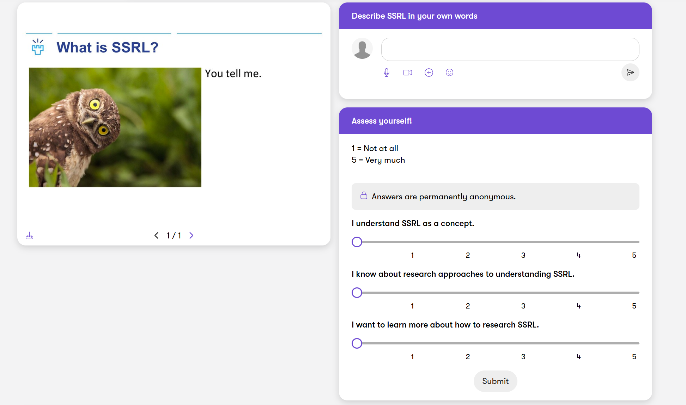

# Teaching Materials

## Video Lectures - Quantitative Data Analysis

<iframe width="560" height="315" src="https://www.youtube.com/embed/playlist?list=PLKsorv8k6sa08MLNOTOXSQqB_X2Y0Blbq" frameborder="0" allow="accelerometer; autoplay; clipboard-write; encrypted-media; gyroscope; picture-in-picture" allowfullscreen></iframe>

## Teaching Slide Examples: 
### Topics in Human-Computer Interaction

<embed src="assets/Topics in HCI.pdf" type="application/pdf" width="100%" height="600px" />

### User-Centered Design

<embed src="assets/Lecture 3.pdf" type="application/pdf" width="100%" height="600px" />

## Interactive Learning Environment Howspace
## Socialy Shared Regulation of Learning (SSRL) Methods

[{:width="100%"}](https://methods-for-capturing-ssrl.in.howspace.com/research-methods-for-ssrl)

[Access the Research Methods for SSRL interactive learning environment](https://methods-for-capturing-ssrl.in.howspace.com/research-methods-for-ssrl) (feel free to explore as a guest)